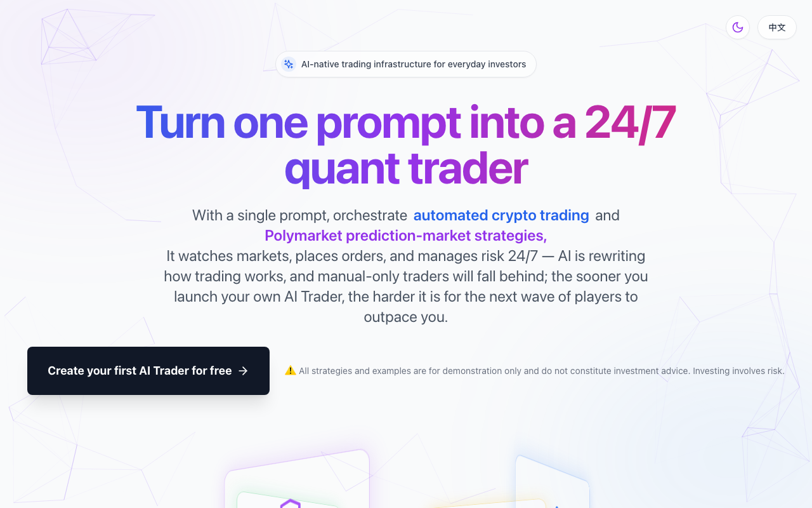
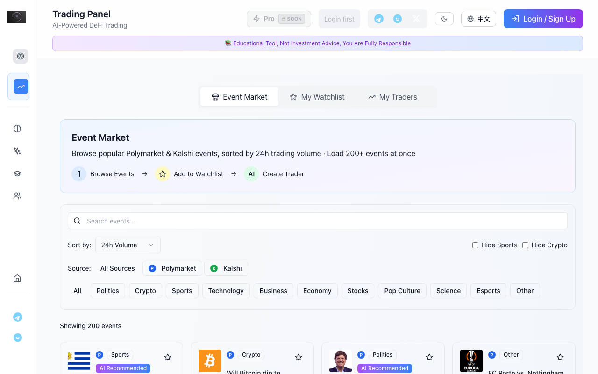

<p align="center">
  
</p>

<h1 align="center">PromptTrading</h1>

<p align="center">
  <strong>Turn one prompt into a 24/7 AI quant trader</strong><br/>
  <sub>Open-source, multi-model, multi-market. From natural language to live orders.</sub>
</p>

<p align="center">
  <a href="https://prompttrading-open.vercel.app"><b>Live Demo</b></a> &middot;
  <a href="#-quick-start">Quick Start</a> &middot;
  <a href="#-features">Features</a> &middot;
  <a href="#-architecture">Architecture</a> &middot;
  <a href="#-demo-mode">Demo</a> &middot;
  <a href="#-contributing">Contributing</a>
</p>

<p align="center">
  
  
  
  
  
  
</p>

<p align="center">
  
</p>

---

## Why PromptTrading?

Most people can't trade 24/7. Algorithmic platforms cost thousands and require coding. "AI trading" apps are black boxes that hide every decision.

**PromptTrading is different.** You describe a strategy in plain English. The platform's multi-model AI engine translates that into executable trading logic -- then monitors markets, manages risk, and places real orders across **Polymarket prediction markets** and **crypto perpetual futures**, around the clock, with full transparency into every decision it makes.

It's the open-source trading infrastructure that gives everyday investors the same edge as quant desks.

<p align="center">
  
</p>

---

## What Can You Do With It?

### Prediction Markets (Polymarket)

Browse 200+ live prediction markets on politics, sports, crypto, pop culture, economy, and tech. The AI engine detects mispriced odds and asymmetric payoffs, then executes trades automatically via the Polymarket CLOB orderbook.

- Real-time market data from Polymarket's public APIs
- AI-powered analysis with multi-model cross-validation (GPT-4, Claude, DeepSeek)
- Automated trader tracking -- follow the strategies of top Polymarket traders
- Safe Wallet (Gnosis Safe) support for secure multi-sig trading
- Smart watchlists with AI alerts on probability shifts

### Crypto Quantitative Trading (Hyperliquid)

Trade BTC, ETH, SOL and 100+ perpetual futures on Hyperliquid with AI-generated signals, automated position sizing, and built-in risk controls.

- Multi-factor technical analysis (RSI, MACD, Bollinger Bands, volume, momentum)
- Prompt-driven strategy creation -- describe your trading thesis in natural language
- Agent Wallet architecture -- delegated signing keeps your main key secure
- Real-time PnL curves, equity charts, and per-trade attribution
- Testnet support for risk-free strategy development

### Paper Trading

Every new user starts with a **$10,000 simulated account**. Test strategies against live market data without risking a single cent. When you're ready, switch to live trading with one click.

---

## Features

### AI Engine

| Capability | Description |
|---|---|
| **Multi-Model Ensemble** | Aggregate GPT-4, Claude, DeepSeek, and custom models. Cross-validate trade ideas to reduce single-model hallucination risk |
| **Prompt-to-Order Pipeline** | Natural language strategy -> signal generation -> risk check -> live order execution. No code required |
| **Streaming Analysis** | Real-time SSE streaming of AI reasoning process, so you see every step the model takes |
| **Semantic Market Search** | Find relevant markets by meaning, not just keywords. Powered by OpenAI embeddings + Cohere reranking |

### Trading Infrastructure

| Capability | Description |
|---|---|
| **Multi-Market Execution** | Polymarket (CLOB), Hyperliquid (perps), DFlow/Kalshi (Solana prediction markets) |
| **Agent Wallet** | Delegated EIP-712 signing wallet -- trades execute on your behalf, main private key never leaves Privy's secure enclave |
| **Safe Wallet** | Gnosis Safe multi-sig for Polymarket -- institutional-grade custody with on-chain approval flows |
| **Auto-Trade Engine** | Background service monitors positions, executes stop-loss/take-profit, and rebalances based on your risk parameters |
| **Cross-Chain Payments** | USDC recharge across Arbitrum, Base, Polygon, Optimism, and Ethereum with on-chain deposit verification |

### User Experience

| Capability | Description |
|---|---|
| **Pro Terminal** | Bloomberg-style dockable workspace (DockView) with configurable chart, orderbook, positions, and news panels |
| **Dark Mode** | Full dark/light theme support across every screen |
| **Bilingual** | Complete English and Chinese (zh-CN) translations for every UI string, including the Learn section |
| **Responsive** | Mobile-first design with bottom navigation on mobile, collapsible sidebar on desktop |
| **Paper Trading** | Default-on simulated trading. Explicit confirmation required to switch to live/mainnet |

### Security

| Capability | Description |
|---|---|
| **No Secrets in Repo** | All API keys, private keys, and credentials are loaded from environment variables or AWS Secrets Manager |
| **Privy Auth** | Embedded wallet creation, social login (email, Google, Apple), and WalletConnect for external wallets |
| **Rate Limiting** | Per-user and per-IP rate limits on all API endpoints |
| **Input Masking** | Wallet addresses and transaction hashes are masked in all production logs via `safeLog` utility |

---

## Architecture

```
                                 Browser
                                    |
                     +--------------+--------------+
                     |                             |
                     v                             v
          Frontend (React + Vite)        Polymarket Public APIs
             Port 3001                   (gamma-api, clob-api)
                     |
                     | /api/*
                     v
          Backend API (Express + Prisma)
             Port 3002
                     |
        +-----+------+------+------+------+
        |     |      |      |      |      |
        v     v      v      v      v      v
      Postgres  AI     Poly   Hyper  DFlow  Privy
               APIs   market liquid  Solana  Auth

          User Management (Strapi 5)  [optional]
             Port 1337
```

### Monorepo Layout

```
src/                        Frontend (React + Vite + TypeScript)
  polymarket/                 Prediction market dashboard, watchlists, trader tracking
  pro-terminal/               Bloomberg-style dockable trading terminal (DockView)
  components/                 40+ UI components: dashboard, trading, wallet, credits
  services/                   API clients, wallet connectors, Polymarket CLOB integration
  hooks/                      Custom hooks: trading flows, delegation, paper trading, SSE
  contexts/                   Global state (Zustand), auth context, wallet context

backend/                    Backend API (Node.js + Express + Prisma)
  controllers/                21 route handlers covering all trading and admin flows
  services/                   30+ service modules: AI, trading, billing, search, monitoring
  middleware/                 Auth (Privy JWT), rate limiting, admin, network switching
  jobs/                       Background workers: deposit scanner, market sync, price cache
  prisma/                     PostgreSQL schema with 14 migration files

user-management/            User Management (Strapi 5 CMS)
  src/api/                    Wallet-based auth, user profiles, content-type schemas
  config/                     Database, middleware, plugin configuration

docs/                       Decision records, deployment guides, privacy checklist
```

See [ARCHITECTURE.md](ARCHITECTURE.md) for the full system diagram and data flow.

---

## Quick Start

### Prerequisites

- **Node.js** >= 18
- **PostgreSQL** (one server, two databases)

### 1. Clone and configure

```bash
git clone https://github.com/jeremy9682/PromptTrading-open.git
cd PromptTrading-open

cp .env.example .env
cp backend/.env.example backend/.env
cp user-management/.env.example user-management/.env
```

Edit the `.env` files:
- `backend/.env` -- set `DATABASE_URL` to your PostgreSQL connection string
- `user-management/.env` -- set database credentials and replace all `toBeModified` placeholder secrets

### 2. Create databases and install

```bash
createdb prompttrading
createdb strapi

make install          # installs all three services at once
```

### 3. Initialize the backend database

```bash
cd backend
npx prisma generate
npx prisma migrate deploy
cd ..
```

### 4. Start services (one terminal each)

```bash
make dev-frontend          # React app on port 3001
make dev-backend           # Express API on port 3002
make dev-user-management   # Strapi CMS on port 1337
```

Or run manually:

```bash
npm run dev                         # frontend
cd backend && npm run dev           # backend
cd user-management && npm run dev   # user management (optional)
```

Run `make help` for all available targets.

---

## What Works Without API Keys

The frontend UI, market browsing (200+ live Polymarket events via public APIs), paper trading interface, and educational content are fully explorable with zero third-party keys.

Features that unlock with your own credentials:

| Feature | Required Keys | What It Enables |
|---------|---------------|-----------------|
| AI analysis | `OPENROUTER_API_KEY` or `OPENAI_API_KEY` | Multi-model market analysis, trade signal generation |
| Wallet login | `PRIVY_APP_ID`, `PRIVY_APP_SECRET` | Embedded wallets, social login, portfolio tracking |
| Polymarket trading | `POLYMARKET_BUILDER_*` credentials | Live CLOB order placement and position management |
| DFlow / Solana | `DFLOW_API_KEY` | Solana-based prediction market trading (Kalshi) |
| Hyperliquid | `HYPERLIQUID_*` credentials | Perpetual futures trading on testnet/mainnet |
| Payments | `COINBASE_COMMERCE_*` or `HELIO_*` | USDC credit recharge via crypto payments |
| Semantic search | `COHERE_API_KEY` (optional) | Enhanced market search with reranking |

See `backend/.env.example` for the complete list of 25+ configurable environment variables.

---

## Demo Mode

Deploy a **safe, read-only public demo** on Vercel (frontend only) with no trading credentials or real funds at risk.

### What the demo shows

- **Live market data** -- 200+ active Polymarket events updated in real time
- **Market categories** -- Politics, Crypto, Sports, Tech, Economy, Pop Culture and more
- **Trader tracking** -- Browse top Polymarket traders and their strategies
- **Full UI** -- Dark mode, responsive layout, bilingual support, all navigation flows
- **Educational content** -- Complete Learn section with trading guides in English and Chinese

### What's disabled without keys

Wallet login, live order execution, AI analysis, and payment flows are gracefully disabled with informative messages.

### One-click Vercel deploy

```bash
vercel link && vercel deploy --prod
```

The included `vercel.json` handles SPA routing, Polymarket API proxying, and security headers automatically. No backend required.

### Safety guarantees

- Paper trading is **on by default** (`isPaperTrading: true`)
- Live trading requires explicit confirmation dialogs
- All trading endpoints return 401 without authentication
- No API keys, private keys, or secrets are included in this repository

See [docs/demo-mode.md](docs/demo-mode.md) for the full boundary reference.

---

## Tech Stack

| Layer | Technology | Why |
|-------|-----------|-----|
| **Frontend** | React 18, Vite, Tailwind CSS, Zustand, DockView | Fast builds, utility-first CSS, Bloomberg-style terminal |
| **Backend** | Node.js, Express, Prisma ORM | Type-safe database access, easy migrations |
| **Database** | PostgreSQL | JSONB for flexible market data, robust transactions for billing |
| **Auth** | Privy, WalletConnect | Embedded wallets + social login, no seed phrase UX |
| **AI** | OpenRouter, OpenAI, DeepSeek, Claude | Multi-model aggregation via single API gateway |
| **Markets** | Polymarket CLOB, Hyperliquid, DFlow/Kalshi | Prediction markets + crypto perps + Solana |
| **Payments** | On-chain USDC (5 chains), Coinbase Commerce, Helio | Crypto-native billing with blockchain verification |
| **Search** | OpenAI embeddings, Cohere reranking | Semantic market discovery beyond keyword matching |
| **User Mgmt** | Strapi 5 CMS | Content types, admin panel, extensible user profiles |

---

## Contributing

We welcome contributions of all kinds -- bug fixes, new features, documentation, translations.

See [CONTRIBUTING.md](CONTRIBUTING.md) for guidelines.

## Security

If you discover a vulnerability, please report it responsibly.

See [SECURITY.md](SECURITY.md) for our security policy and disclosure process.

## License

MIT -- see [LICENSE](LICENSE).

---

## Documentation

| Doc | Description |
|-----|-------------|
| [Architecture](ARCHITECTURE.md) | Full system diagram, service descriptions, data flow |
| [Demo Mode](docs/demo-mode.md) | What's safe to expose in a public demo, endpoint-by-endpoint |
| [Vercel Deployment](docs/vercel-deployment.md) | Step-by-step frontend deployment guide |
| [Open Source Audit](docs/OPEN_SOURCE_AUDIT.md) | Keep/remove/redact decisions for this snapshot |
| [License Decision](docs/LICENSE_DECISION.md) | Rationale for choosing MIT |

---

<p align="center">
  <sub>Built with AI, shipped for everyone.</sub>
</p>
